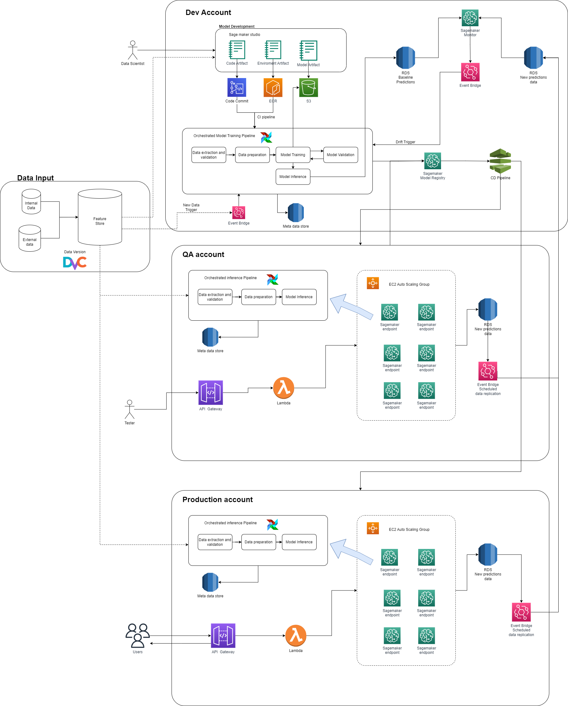

# MLOps Sample Pipeline Design

Hi I'm Pedro and I'm an industrial engineer passionate about software developtmente and data science.

This is my first draft of a MLOps, it was quite challenging for me but I really enjoyed making it up.

I'm pretty good at python and SQL and although I'm not a MLOps expert, I have knowledge and skills in software development and I'm always looking forward learning new things.

My goal is to become a full stack data scientist being capable of develop a model, create a microservice and deploy it applying MLOps principles.

## Part 1: Pipeline Design

## Part 2: Pipeline Explanation

In this I'll explain in detail my design

This draft is based on the following assumptions:
- All infraestructure is on AWS
- There is an unlimited budget and not restriction for any AWS service
- All the Data Engineering has been done to get clean data for any given model to a Redshift DataWarehouse.
- Models runs on a EC2 instances

Just like in software development this draft consider three enviroments: development, quality and production.

### Data Input
The data input process involves all steps related with collection, preprocesing, cleaning, integration and store; using data from internal and external sources. In this case, it is assumed that this process has already be done and the information lies in a Redshift DataWarehouse. This data can be version for different models, using DVC, when training them. 

This dataWarehouse should serve as an only source of truth and all the enviroments (dev, qa and production) should use it.

### Dev Account
Here is where the data scientist team will develop their models using sage maker and performing version code withe code commit as well as versioning environment with ECR. Once they upload the model, a pipeline for model training will be triggered, model artifact will be stored in a S3 and meta data of the pipeline execution will be save in an RDS database. The versioning of the model is done by using sage maker model registry.

During training, models inference data (predictions, metrics, data version, ...) is store in a RDS which will serve as a baseline for comparison when training new models and for detecting model and data drift

### QA Account
Once training pipeline execution finish and model registry is done, the models are deploy in the quality account for testing. In these account, an orchestrated inference pipeline will be executted and meta data will be stored in and RDS database.

Once the model is deployed in QA environment, a tester can make request to the sage maker endpoints, which are in an auto scaling EC2 group; connected to an lambda and api gateway. Predictions will be stored in an RDS database and ans scheduled data replication process will copy this data into an RDS database in the Dev Account.

### Production Account
Once the models are tested and is working according to expected, the model is update in the model registry and the model is deploy in the production environment.

Models are deployed into an EC2 auto scaling group so in case the request's volume increase; the performance of the system won't be affect and won't overload.

Predictions will be stored in an RDS database and ans scheduled data replication process will copy this data into an RDS database in the Dev Account.

Prediction data from QA and Production will be compare with the baseline and if there is a significant difference between these two databases, then a trigger will be activated for retraining models.

A retraining trigger will be also activated when there is a significant  amount of new data in the feature store (Redshift DataWarehouse)